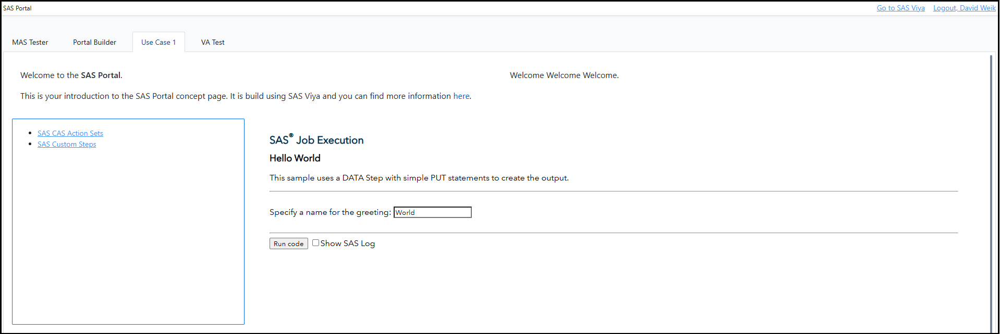

# SAS Portal Framework for SAS Viya

## Overview
The SAS Portal Framework for SAS® Viya® enables you to build your portal to share reports, texts, link list, jobs and more in a structured way.
This project builds on top of the SAS® Viya® SDKs and the SAS® Viya® APIs.

Find a video walking you through the setup and the general UI [here](https://youtu.be/ZifDM_n20p0).

This is what the example portal that is included in this repository looks like:



For a better documentation expierence check out the [SAS Portal Framework for SAS Viya documentation page](https://sassoftware.github.io/sas-portal-framework-for-sas-viya/).

## Installation

### Prerequisites
Ensure that you have followed the setup guides of the [SAS Visual Analytics SDK](https://developer.sas.com/sdk/va/docs/guides/viya-setup/) and the [SAS Content SDK](https://developer.sas.com/sdk/content/docs/getting-started/#sas-viya-setup) before proceeding.

If you want to use this SAS Portal as a hybrid solution with SAS 9.4 content, you must remove the option _Header set X-Frame-Options SAMEORIGIN_ from the SAS Webserver configuration.
See the [SAS documentation](https://go.documentation.sas.com/doc/en/bicdc/9.4/vaicg/p1gi7u7b71vwbxn1rt9tu0h61f5t.htm).

Changes to the SAS Portal are documented in the [CHANGELOG.md](./CHANGELOG.md).

You will also need a webserver, where you will place the files of this portal. 
If you run the webserver under the same top level URL as the SAS Viya host, you will not have to change `config.js`.
If you don't, please see information in the Sample Content & `config.js` section.

### Getting Started

#### CDN Setup
The default setup provided in this project is done by pulling the dependencies via CDNs. 
To see what is used see the links below, if you prefer to use your own hosted versions please take a look at the local setup section.

```html
<!-- Bootstrap Style -->
<link href="https://cdn.jsdelivr.net/npm/bootstrap@5.3.1/dist/css/bootstrap.min.css" rel="stylesheet" integrity="sha384-4bw+/aepP/YC94hEpVNVgiZdgIC5+VKNBQNGCHeKRQN+PtmoHDEXuppvnDJzQIu9" crossorigin="anonymous">

<!-- Import SAS SDKs and Third-Party Utilities -->
<script src="https://cdn.developer.sas.com/packages/sas-auth-browser/latest/dist/index.min.js"></script>
<script src="https://cdn.developer.sas.com/packages/content-components/latest/dist/umd/content-sdk-components.js"></script>
<script src="https://cdn.developer.sas.com/packages/va-report-components/latest/dist/umd/va-report-components.js"></script>
<script src="https://cdn.jsdelivr.net/npm/bootstrap@5.3.1/dist/js/bootstrap.bundle.min.js" integrity="sha384-HwwvtgBNo3bZJJLYd8oVXjrBZt8cqVSpeBNS5n7C8IVInixGAoxmnlMuBnhbgrkm" crossorigin="anonymous"></script>
<script type="module" src="https://cdn.jsdelivr.net/gh/zerodevx/zero-md@2/dist/zero-md.min.js"></script>
```

And if you are making use of the Portal Builder object then you will also need to update */static/portalBuilder.html*:

```html
<!-- Bootstrap Style -->
<link href="https://cdn.jsdelivr.net/npm/bootstrap@5.3.1/dist/css/bootstrap.min.css" rel="stylesheet" integrity="sha384-4bw+/aepP/YC94hEpVNVgiZdgIC5+VKNBQNGCHeKRQN+PtmoHDEXuppvnDJzQIu9" crossorigin="anonymous">

<!-- Bootstrap SDK -->
<script src="https://cdn.jsdelivr.net/npm/bootstrap@5.3.1/dist/js/bootstrap.bundle.min.js" integrity="sha384-HwwvtgBNo3bZJJLYd8oVXjrBZt8cqVSpeBNS5n7C8IVInixGAoxmnlMuBnhbgrkm" crossorigin="anonymous"></script>
```

#### Local Setup
This setup guide will showcase how to use only local resource and not pull any dependencies dynamically from the web. 
To download the different SDKs & Third-Party libraries [npm](https://www.npmjs.com/) will be used.
For setup help for npm please refer to [this guide](https://docs.npmjs.com/downloading-and-installing-node-js-and-npm).

Download the [SAS Auth Browser](https://github.com/sassoftware/sas-viya-sdk-js/tree/main/sdk/sas-auth-browser) using npm:

```bash
npm install @sassoftware/sas-auth-browser
cp -r ./node_modules/@sassoftware/sas-auth-browser ./sdk-assets/auth
```

Download the [SAS Content SDK](https://github.com/sassoftware/sas-viya-sdk-js/tree/main/sdk/content-components) using npm:

```bash
npm install @sassoftware/content-components
cp -r ./node_modules/@sassoftware/content-components ./sdk-assets/content
```

Download the [SAS Visual Analytics SDK](https://github.com/sassoftware/sas-viya-sdk-js/tree/main/sdk/va-report-components) using npm:

```bash
npm install @sassoftware/va-report-components
cp -r ./node_modules/@sassoftware/va-report-components ./sdk-assets/va-report-components
```

Download [Bootstrap](https://getbootstrap.com/docs/5.3/getting-started/download/) using npm:

```bash
npm install bootstrap@5.3.0-alpha1
cp -r ./node_modules/bootstrap/dist/css ./sdk-assets/bootstrap/css
cp -r ./node_modules/bootstrap/dist/js ./sdk-assets/bootstrap/js
cp -r ./node_modules/bootstrap/scss ./sdk-assets/bootstrap/scss
```

Download the [Markdown Renderer](https://github.com/zerodevx/zero-md) using npm - used for Text Objects:

```bash
npm install zero-md
cp -r ./node_modules/zero-md/dist ./sdk-assets/zero-md
```

If you have followed all of the download and copying steps detailed above, change the following in the `index.html` page under the comment `Import SAS SDKs` and `Third-Party Utilities`:

```html
<script src="./sdk-assets/auth/dist/index.js"></script>
<script src="./sdk-assets/content/dist/umd/content-sdk-components.js"></script>
<script src="./sdk-assets/va-report-components/dist/umd/va-report-components.js"></script>
<script src="./sdk-assets/bootstrap/js/bootstrap.bundle.min.js"></script>
<script type="module" src="./sdk-assets/zero-md/zero-md.min.js"></script>
```

And in the `head` element under the comment Bootstrap Style replace the `link` element with the following:

```html
<link href="./sdk-assets/bootstrap/css/bootstrap.min.css" rel="stylesheet">
```

And in `static/portalBuilder.html`, also replace the link element in the `head` element as above. 
Under `Bootstrap SDK`, replace the script element with:

```html
<script src="./sdk-assets/bootstrap/js/bootstrap.bundle.min.js"></script>
```

## Running

### Sample Content and Config.js
If you want to use the sample content, then import the [Portal-Content-EM.json](./Portal-Content-EM.json) and [Content-EM.json](./Content-EM.json) using SAS Environment Manager or the viya-admin CLI. 
The examples include also static links to SAS Jobs.
This applies to `Use Case 1/interactiveContent-example.json` where you will need to replace the URL with your Viya host.
If you replace the file, you will need to update the `portal-page-layout.json` accordingly with the new file URI.
The `VA Test` page also requires an additional setup: run the `Load-HMEQ.sas` file in `Content/VA Reports`, which will load the hmeq table from sampsio to public.

Go to [config.js](./config.js), search for **VIYA** and replace the value `window.location.origin` with your SAS Viya host if your webserver is not located under the same URL as the Viya host.

If you imported the sample content you can skip this step, if you created your own portal folder you have to search for **PORTAL** and replace the value `68384628-8305-4285-9f16-0cdc57d13dc5` if the URI of your portal folder (go to the folder in SAS Environment Manager, select it and copy just the URI ID— everything after `/folders/folders/`).

### Multi-Language Support

The baseline interface comes with native multi language support. 
The displayed language is determined by the users browsers language. 
Then a file from the languages folder is loaded. The portal comes with English and German support, if you want to add an additional language just copy the _language/en.json_ file, rename it to the desired lowercase [ISO-639-1 language code](https://en.wikipedia.org/wiki/ISO_639-1) and the translate the values of the attributes.

## Contributing
Maintainers are accepting patches and contributions to this project.
Please read [CONTRIBUTING.md](CONTRIBUTING.md) for details about submitting contributions to this project.

## License
Except for the the contents of the `/static` folder, this project is licensed under the [Apache 2.0 License](LICENSE).
Elements in the `/static` folder are owned by SAS and are not released under an open source license.
This project uses the Bootstrap library, which is under the MIT license. It also uses the Zero-MD library, which is under the ICS license.
SAS and all other SAS Institute Inc. product or service names are registered trademarks or trademarks of SAS Institute Inc. in the USA and other countries. 
® indicates USA registration.

## Additional Resources

* [SAS Visual Analytics SDK](https://developer.sas.com/sdk/va/docs/guides/viya-setup/)
* [SAS Content SDK](https://developer.sas.com/sdk/content/docs/getting-started/#sas-viya-setup)
* [SAS Auth Browser](https://github.com/sassoftware/sas-viya-sdk-js/tree/main/sdk/sas-auth-browser)
* [SAS Viya API documentation](https://developer.sas.com/rest-apis)
